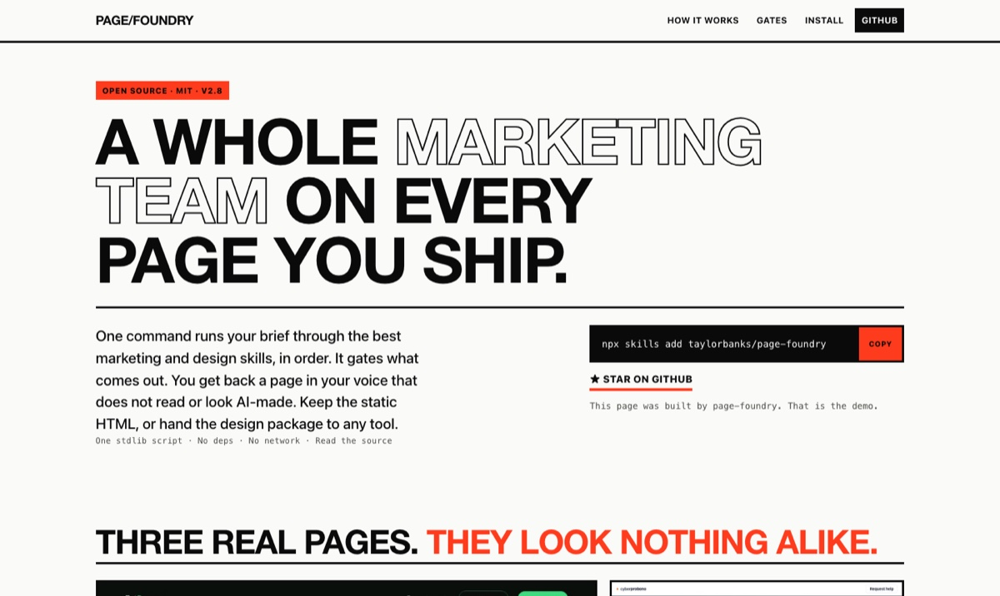

<div align="center">

# page-foundry

### A whole marketing team on every page you ship.

[](https://www.npmjs.com/package/page-foundry)
[](https://github.com/taylorbanks/page-foundry/releases)
[](LICENSE)
[](package.json)
[](https://github.com/taylorbanks/page-foundry)
[](skills/page-foundry/references/ship-gates.md)

```bash
npx page-foundry install
```

<a href="https://taylorbanks.github.io/page-foundry/"></a>

<sub>The homepage above was built by page-foundry. That is the demo. &nbsp;·&nbsp; <a href="https://taylorbanks.github.io/page-foundry/">Live site</a></sub>

</div>

---

page-foundry is a Claude Code skill. One command runs your brief through the best marketing and design skills, in order. It gates what comes out. You get back a page in your voice that does not read or look AI-made. Keep the static HTML, or take the design package to any tool.

## The problem it solves

You ship a lot of pages. New product, new landing page, new launch, new course. An agent will write each one, and each comes out a little different: a different voice, a different structure, conversion by guesswork, and the same generic look every other AI is producing right now. Some of those pages quietly talk a qualified buyer out of buying. None of them will stop themselves from inventing a testimonial you never got.

page-foundry fixes the process, not the sentence. The same voice across fifty pages. Conversion decisions from published research instead of taste. Copy a real buyer would believe. And a hard line against fabricated proof.

## What you get

| | |
|---|---|
| **Converts by method, not luck** | Structure and copy follow conversion research: one clear action, message matched to the traffic, proof beside every claim. Scored against the MECLABS Conversion Sequence before it ships. |
| **One voice across everything** | Your writing rules live in a file a scanner enforces, so page forty sounds like page one. |
| **Does not read or look AI-made** | A voice scan rejects the vocabulary *and* the language patterns that mark machine-written copy, including the negative parallelism and three-verb runs a word list cannot catch. The design phase rejects the visual defaults that give an AI page away. |
| **Nothing is faked** | It will not invent a testimonial, a number, a command, or a staged screenshot of something that did not happen. If your proof is thin, it builds around what is real and tells you what to collect. |
| **Accessible and fast** | Contrast, keyboard access, semantic markup, a weight budget, and a load target are gates the page has to clear, not good intentions. |
| **A page you own** | Static HTML you host anywhere, or a copy-and-design package for a design tool. You are not tied to a platform. |

## Whatever page you need

Sixteen page archetypes, each a conversion contract rather than a fixed template: open source project, SaaS homepage, campaign landing, pricing, comparison, docs, waitlist, event, agency, e-commerce, mobile app, course sales, membership, newsletter, personal site, and a launch changelog. Section order follows how your buyer raises objections instead of a numbered slot, and a page that straddles two archetypes gets a merged contract.

Three ways to run it:

- **`build`**: one brief in, a finished page out.
- **`explore`**: contrasting design directions first; you pick, then it builds the winner.
- **`handoff`**: a complete copy-and-design package for Claude Design, Open Design, Codex, Gemini, or any tool you build with.

## Install

```bash
# npm (recommended)
npx page-foundry install
```

Prefer another channel:

- **skills CLI:** `npx skills add taylorbanks/page-foundry`
- **Claude Code plugin:** `claude plugin marketplace add taylorbanks/page-foundry` then `claude plugin install page-foundry@page-foundry`
- **claude.ai:** upload the `.skill` file from the [latest release](https://github.com/taylorbanks/page-foundry/releases)

<details>
<summary>Install flags for <code>npx page-foundry install</code></summary>

```
--project        install to ./.claude/skills instead of ~/.claude/skills
--agents         install to ~/.agents/skills
--dir <path>     install under <path>/page-foundry
--with-commands  also write a /page-foundry command stub
--dry-run        print actions without writing
--force          overwrite an existing install
```

The installer, `bin/page-foundry.js`, is one dependency-free Node file with no network calls and no telemetry, built on Node standard modules only. It preserves a customized `voice.md` across updates. Read it before you run it.
</details>

## First run

Run `/page-foundry` with no arguments for orientation. Then say "set up my voice": a short wizard writes your voice rules, which also drive the scanner, so your writing guidance and the enforcement can never drift apart. Until then a neutral default applies.

## How it gets that quality

page-foundry is an orchestrator. It does not reinvent marketing; it invokes the best skills that already exist, in the right order, and refuses to ship what does not pass. Positioning, copy, conversion, and psychology come from a proven marketing skill set. Design direction comes from real design guidelines, not a model's guess at "modern." When a skill it relies on is not installed, it uses a weaker built-in fallback and tells you the run is partial, rather than pretending. Every page then runs checks that a page failing on voice, conversion, accessibility, honesty, or performance cannot get past, so "an AI wrote it" never shows.

## Built on

These projects do the heavy lifting. page-foundry does the sequencing and the checking, and it is a lesser tool without any of them. All optional at runtime; the skill degrades to built-in condensed rules when they are absent. Install them anyway.

- [marketingskills](https://github.com/coreyhaines31/marketingskills) by [Corey Haines](https://www.corey.co): product-marketing, copywriting, CRO, customer-research, pricing, and psychology.
- [Anthropic's skills](https://github.com/anthropics/skills): frontend-design, web-artifacts-builder, and skill-creator.
- [web-design-guidelines](https://github.com/vercel-labs/agent-skills) by Vercel Labs: accessibility, typography, and UX rules.
- [humanizer](https://github.com/blader/humanizer) by blader: the "Signs of AI writing" pattern set behind the copy pattern pass.
- [gstack](https://github.com/garrytan/gstack) by Garry Tan: design consultation, the variant shotgun, and visual review.
- [Remotion](https://www.remotion.dev): hero demo clips and motion, when a page earns them.
- The [MECLABS Institute](https://meclabs.com) Conversion Sequence heuristic.
- The [skills CLI and skills.sh](https://skills.sh) by Vercel.

## Security

Skills run with your agent's permissions. page-foundry ships one program: `scripts/voice_scan.py`, standard-library Python, no network, no subprocess, no dependencies. The npm installer, `bin/page-foundry.js`, is the same story: zero dependencies, Node built-ins, no network. Read both before you install. The skill installs companions only from the pinned sources in its table, only with your approval, never from search results. See [SECURITY.md](SECURITY.md) for reporting. page-foundry is built by a security practitioner who assumes you will not take any of that on faith.

## License

MIT. See [LICENSE](LICENSE).
